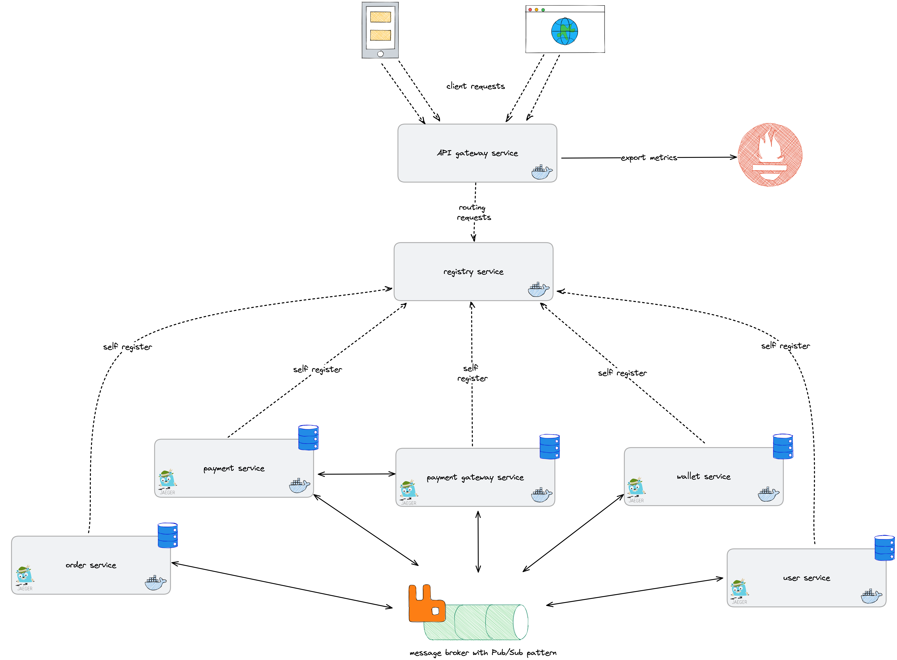
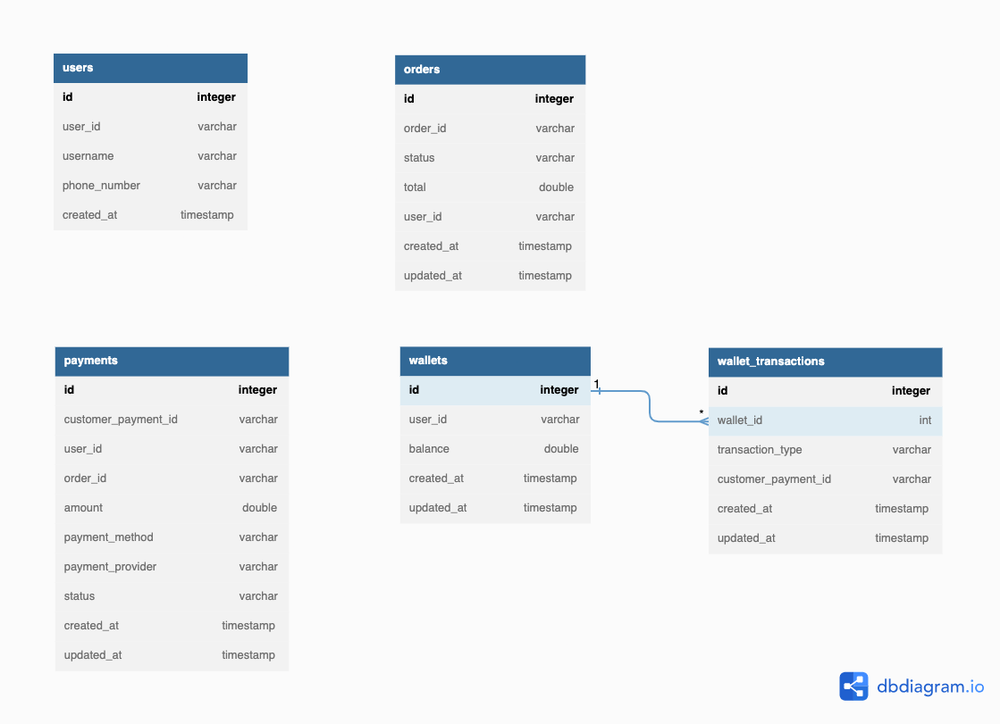

# Develop Payment Application with Microservices Architecture

### Architecture

High-Level Design

Low-Level Design (ERD)

---

### Functional Requirement

- payment-service
  1. [x] able to perform charge payment
  2. [x] able to perform refund
  3. [x] able to get latest payment status
- wallet-service
  1. [x] able to top-up the wallet balance
  2. [x] able to credit user wallet balance
  3. [x] able to debit user wallet balance
  4. [x] able to get list of user wallet transaction
- payment-provider-gateway-service
  1. [ ] able to simulate payment flow to respective external payment provider
- order-service
  1. [x] CRUD order items
  2. [x] checkout order (payment)
  3. [x] cancel order (refund)
- user-service
  1. [x] CRUD
- API gateway-service
  1. [x] able to route the request accordingly
- registry-service
  1. able to monitor all services

---

### Non-functional Requirement

- should be able to handle ACID from data POV
- should be able to perform retry in case payment is failed
- should be able to handle high volume of transactions with low latency
- should be able to handle scalability aspect
    - auto-scaling
    - load-balancing
- should be able to handle availability aspect
    - reduce single point of service (correlate with scalability)
    - add monitoring capability
        - use logging
        - use metrics (Prometheus)
        - use tracing (Jaeger)
        - health checks (API Gateway will collect all the health check status and export to Prometheus)

### Tech stack

| Name                  | Descriptions                       |
|-----------------------|------------------------------------|
| Spring boot + Java 11 | Framework and programming language |
| MySQL                 | Database                           |
| Kong                  | API Gateway                        |
| Consul                | Service Discovery                  |
| RabbitMQ              | Messaging Platform                 |
| Jaeger                | Tracing capability                 |
| Prometheus            | Monitoring                         |

### Service communication

We’re going to implement mixed communication type, which sync and async.

1. Sync communication will be done through HTTP only for :
   `payment-service` → `payment-gateway-service`
2. Async communication will be done through messaging (RabbitMQ) and using Pub/Sub pattern.

